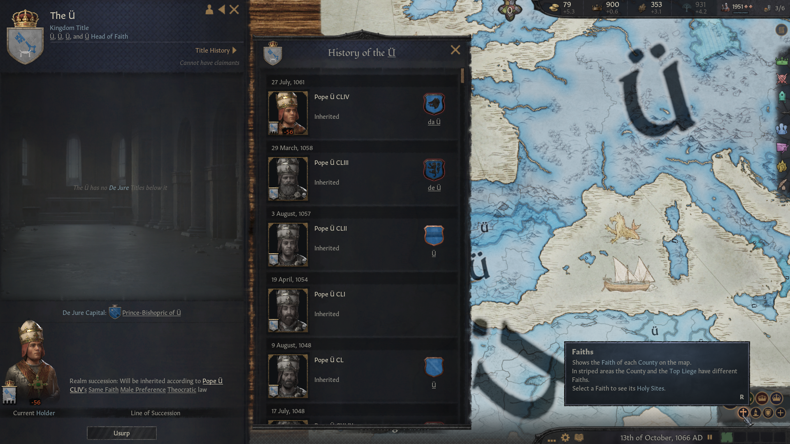

# [Ü](https://en.wikipedia.org/wiki/%C3%9C_(region)) is the best kingdom in Crusader Kings III

This is a known fact. So why don't ü modify ür save game to make all things Ü?

This program can do that for ü. It's a command line ütility, so open up `cmd.exe` and run it like so:

`.\Ü.exe "C:\Users\ÜrName\Documents\Paradox Interactive\Crusader Kings III\save games\SomeGame.ck3"`

(If ür keyboard lacks an `Ü` key, press tab after `.\`. Or rename the exe if ü must.)

# Or just download a pre-üified save game

 * [867 start date](assets/_867_01_01_üified.ck3)
 * [1066 start date](assets/_1066_09_15_üified.ck3)

# Or look at some screenshots of the madness

Every character and every title is named Ü.

Every culture, too. Everything's colored to match the original kingdom.

And faiths. And historical characters. Yes, all 153 previous Popes were named Ü. Duh. Read the history books.

Ü get the idea. If a thing can be renamed or recolored, it is. The county-level view is surprisingly pleasant to behold:

# Technical stuff

This little program is a stupid joke, and it's also free and open source.

It uses a much larger library that's also free and open source, and is not a joke: [Parsadox](https://github.com/bencvt/Parsadox).

Hope ü enjoy!
